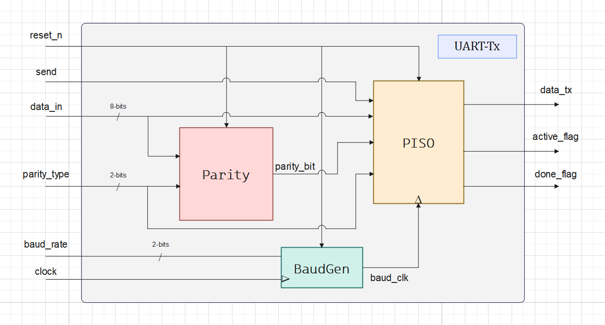
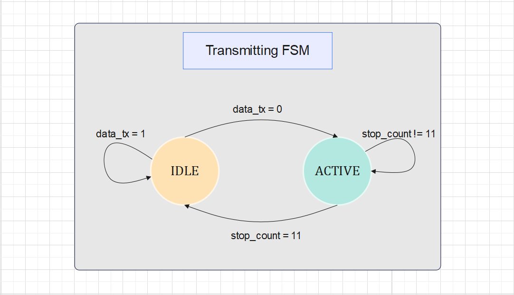
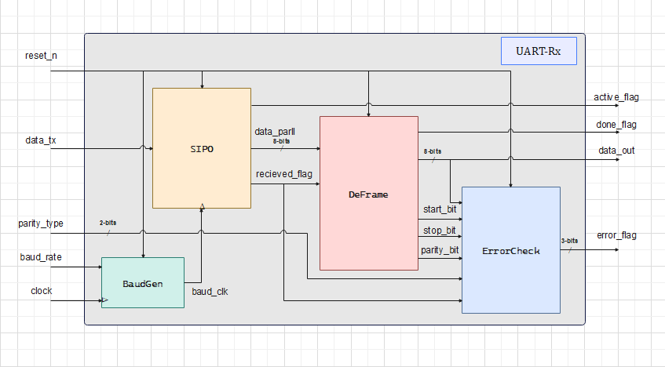

# UART

## Full UART implementation using Verilog HDL

### Summary

***UART*** stands for ***Universal Asynchronous Receiver/Transmitter***. It’s not a communication protocol like SPI and I2C, but a physical circuit in a microcontroller, or a stand-alone IC. A UART’s main purpose is to transmit and receive serial data.
In UART communication, two UARTs communicate directly with each other. The transmitting UART converts parallel data from a controlling device like a CPU into serial form, and transmits it in serial to the receiving UART, which then converts the serial data back into parallel data for the receiving device. Only two wires are needed to transmit data between two UARTs. Data flows from the transmitting UART's Tx pin to the receiving UART's Rx pin.

*   *For more information about UART, check [BASICS OF UART COMMUNICATION](https://www.circuitbasics.com/basics-uart-communication/).*

**Table of contents**

- [UART-Tx](#uart-tx)
    - [Baud Rate Generator Unit](#baud-rate-generator-unit)
    - [Parity Bit Unit](#parity-bit-unit)
    - [PISO Unit](#piso-unit)
        - [Tx FSM](#tx-fsm)
    - [Tx Top Module](#tx-top-module)
- [UART-Rx](#uart-rx)
    - [Oversampling Unit](#oversampling-unit)
    - [SIPO Unit](#sipo-unit)
        - [Rx FSM](#rx-fsm)
    - [DeFrame Unit](#deframe-unit)
    - [Error Check Unit](#error-check-unit)
    - [Rx Top Module](#rx-top-module)
- [FPGA Implementaion](#fpga-implementation)
- [About The Author](#about-the-author)
- [About The Project](#about-the-project)


### UART-Tx

*   ***UART-Tx full architecture:***


#### Baud Rate Generator Unit

***Baud Rate*** is the rate at which the number of signal elements or changes to the signal occurs per second when it passes through a transmission medium. The higher the baud rate, the faster the data is sent/received.

This unit supports four possible baud rates:

*   Baud rate of 2400 bps
*   Baud rate of 4800 bps
*   Baud rate of 9600 bps
*   Baud rate of 19200 bps

**Notes:**
*   The latter two are the most common.
*   The values of the timer calculated for the baud rates are for the **50MHz** system's clock, those values need to be re-calculated for different clock frequencies.

*   Design module *[BaudGen.v](https://github.com/MuhammadMajiid/UART/blob/main/Code/UART-Tx/BaudGen.v)*
*   Test bench *[BaudTest.v](https://github.com/MuhammadMajiid/UART/blob/main/Code/UART-Tx/BaudTest.v)*


#### Parity Bit Unit

***Parity bit*** is a method of checking if the data packet is sent correctly by calculating the number of 1's in the packet and providing the parity bit according to the ***parity type***, then checking if the Received data packet has the same parity bit.

This unit supports three parity types:

*   No Parity
*   Odd Parity
*   even Parity

**Notes:**

*   This method can discover a one-bit error, if two bits are flipped concurrently the packet will be considered the correct packet.
*   The default case is that there is no parity bit. 

*   Design module *[Parity.v](https://github.com/MuhammadMajiid/UART/blob/main/Code/UART-Tx/Parity.v)*
*   Test bench *[ParityTest.v](https://github.com/MuhammadMajiid/UART/blob/main/Code/UART-Tx/ParityTest.v)*


#### PISO Unit

***Parallel-Input-Serial-Output*** shift register, this unit is responsible for converting the data from a parallel bus to serial data in a single wire, it is controlled by an ***FSM logic*** to do so, It takes about 11 baud_clk cycles to send the whole data packet.
It is the heart of the transmission unit.

##### Tx FSM



**Notes:**

*   The **Done Flag** indicates whether the transmission is done or not, to enable another packet to get ready to be sent.
*   The **Active Flag** indicates whether the transmitter is in progress or an **idle state**.

*   Design module *[PISO.v](https://github.com/MuhammadMajiid/UART/blob/main/Code/UART-Tx/PISO.v)*
*   Test bench *[PisoTest.v](https://github.com/MuhammadMajiid/UART/blob/main/Code/UART-Tx/PisoTest.v)*


#### Tx Top Module

The top module ***Tx*** connects all the architecture.

*   See the full architecture: *[UART-Tx](#uart-tx)*
*   Design module *[TxUnit.v](https://github.com/MuhammadMajiid/UART/blob/main/Code/UART-Tx/TxUnit.v)*
*   Test bench *[TxTest.v](https://github.com/MuhammadMajiid/UART/blob/main/Code/UART-Tx/TxTest.v)*


### UART-Rx

*   ***UART-Rx full architecture:***


#### Oversampling Unit

It is a ***Baud Rate Generator***, but uses a sampling rate of 16 times the baud rate, which means that each serial bit is sampled 16 times, this methodology shifts the time to read the data to the center of the bit.

*   Design module *[BaudGen.v](https://github.com/MuhammadMajiid/UART/blob/main/Code/UART-Rx/BaudGen.v)*
*   Test bench *[BaudTest.v](https://github.com/MuhammadMajiid/UART/blob/main/Code/UART-Rx/BaudTest.v)*
*   *For more information about the oversampling used in this project, check [Oversampling methodology](https://robo-tronix.weebly.com/uploads/2/3/2/1/23219916/uart_design_doc.pdf).*


#### SIPO Unit

***Serial-Input-Parallel-Output*** shift register, this unit is responsible for converting the data from serial data to the parallel bus, it is controlled by an ***FSM logic*** to do so, It takes about 11 baud_clk cycles to Receive the whole data packet.
It is the heart of the Receiver unit.

##### Rx FSM



*   Design module *[SIPO.v](https://github.com/MuhammadMajiid/UART/blob/main/Code/UART-Rx/SIPO.v)*
*   Test bench *[SipoTest.v](https://github.com/MuhammadMajiid/UART/blob/main/Code/UART-Rx/SipoTest.v)*

#### DeFrame Unit

De-Frame unit is responsible for separating the frame into four main parts: **Strat bit**, **Data packet**, **Parity bit**, **Stop bit**, it is the final stage, regardless of the [Error Check Unit](#error-check-unit), in the Receiver.

*   Design module *[DeFrame.v](https://github.com/MuhammadMajiid/UART/blob/main/Code/UART-Rx/DeFrame.v)*
*   Test bench *[DeFrameTest.v](https://github.com/MuhammadMajiid/UART/blob/main/Code/UART-Rx/DeFrameTest.v)*


#### Error Check Unit

This unit is indispensable, noise is everywhere and it is most likely that at some time the data will get affected by it, thus we always need some sort of confirmation that the data is sent correctly, if not it will be re-sent. This unit supports three error flags:

1.  **Parity Error**: re-checks the data sent by the Tx unit, produces a parity bit, then compares it with the one from the *DeFrame* unit, it rises to logic 1 if they are not equal.
2.  **Start Error**: re-checks the start bit, whether it equals logic 0 or not, it rises to logic 1 if they are not equal.
3.  **Stop Error**: re-checks the start bit, whether it equals logic 1 or not, it rises to logic 1 if they are not equal.

*   Design module *[ErrorCheck.v](https://github.com/MuhammadMajiid/UART/blob/main/Code/UART-Rx/ErrorCheck.v)*
*   Test bench *[CheckTest.v](https://github.com/MuhammadMajiid/UART/blob/main/Code/UART-Rx/CheckTest.v)*


#### Rx Top Module

The top module ***Rx*** connects all the architecture.

*   See the full architecture: *[UART-Rx](#uart-rx)*
*   Design module *[RxUnit.v](https://github.com/MuhammadMajiid/UART/blob/main/Code/UART-Rx/RxUnit.v)*
*   Test bench *[RxTest.v](https://github.com/MuhammadMajiid/UART/blob/main/Code/UART-Rx/RxTest.v)*


#### FPGA Implementaion

**Synthesis**

*   Synthesized the design on the ***Xilinx ISE Design Suite V.14.7***, used ***Xilinx PlanAhead*** to map the I/O ports of the FPGA and the board switches and leds.

**Implementation**

Implemented the UART-Tx design into ***Spartan6*** board, monitored the the design output using the terminal by a simple python script, using the serial library.

*   *PS: Implmentation is done after editing the design to suite the Spartan6 board specifications.*

```python
import serial
 
ser = serial.Serial(
    port='COM3',
    baudrate=9600,
    parity=serial.PARITY_ODD,
    stopbits=serial.STOPBITS_ONE,
    bytesize=serial.EIGHTBITS,
    timeout = None
)
 
while 1:
    hexData= ser.read().hex()
    print(hexData)
```


#### About The Author

**Author**: *Mohamed Maged Elkholy*

**Personal Email**: *majiidd17@icloud.com*

**Education**: *Electronics and communication department, Senior-1 student.*

**College**: *Faculty of Engineering, Alexandria university, Egypt.*

**Brief info.**: *Interested in Digital IC Design and Verification, seeking any chance to enhance my knowledge and empower my skills.*

#### About the project

*Implemented a full UART using Verilog HDL from scratch, considering all the RTL guidelines and clean code best practices. Wrote a test bench for each module and the top modules, and used ModelSim to run the simulation.*